# Active Directory Homelab

## Overview
This project is a hands-on Active Directory homelab designed to simulate a small enterprise-style environment using VMware Workstation, Windows Server 2025, pfSense, and Windows 11.

The lab includes segmented virtual networks, Active Directory Domain Services, DNS, DHCP, Group Policy, department-based file shares, and PowerShell automation. I also documented several troubleshooting scenarios involving DHCP, routing, domain controller naming, and time synchronization.

## Network Diagram

  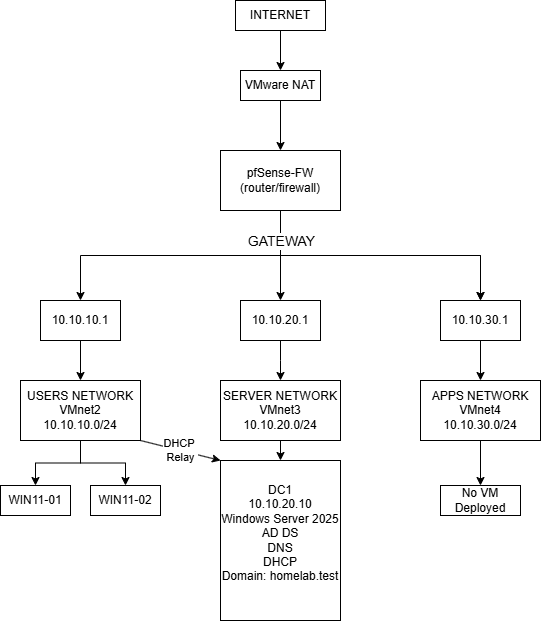

## Network Architecture

- **Users Network:** VMnet2 — `10.10.10.0/24`
- **Servers Network:** VMnet3 — `10.10.20.0/24`
- **Apps Network:** VMnet4 — `10.10.30.0/24`
- **pfSense** routes traffic between each network and provides access to the internet through VMware NAT.
- **DC1:** `10.10.20.10`
- **Domain:** `homelab.test`

## Technologies Used

- VMware Workstation
- Windows Server 2025
- Windows 11 Pro
- Active Directory Domain Services
- DNS
- DHCP
- Group Policy
- pfSense
- PowerShell

## Active Directory Configuration

I created the `homelab.test` domain and organized users and computers into separate Organizational Units for HR, IT, Sales, Servers, and Workstations.

  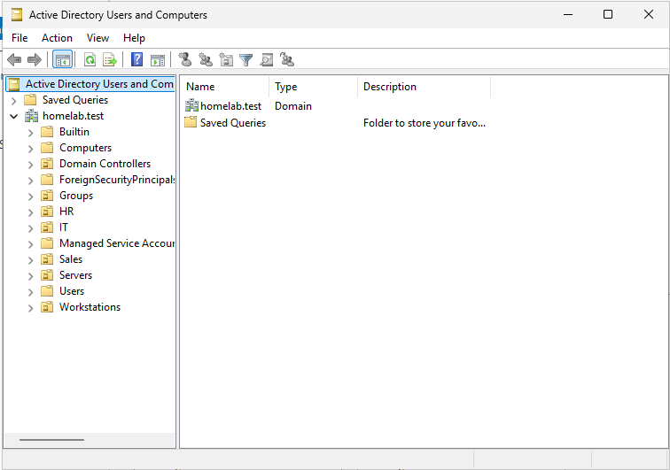

Security groups were created for each department:

- `GG_HR`
- `GG_IT`
- `GG_Sales`

  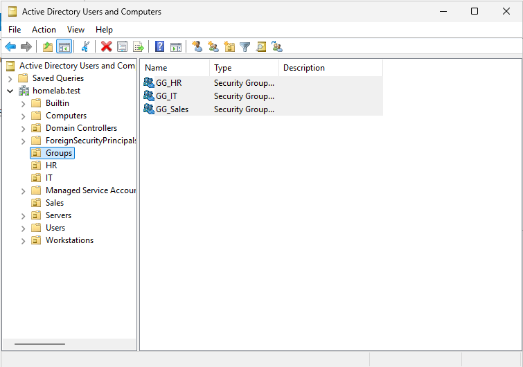

## DNS and DHCP

DC1 was configured with a static IP address of `10.10.20.10` and provides DNS and DHCP services for the domain.

  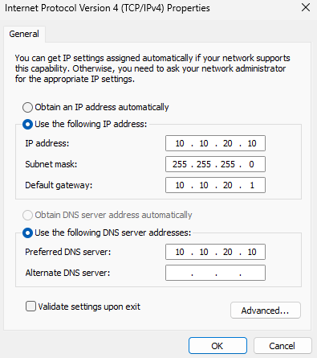

The DHCP scope assigns addresses from `10.10.10.100` to `10.10.10.200` to devices on the Users network.

  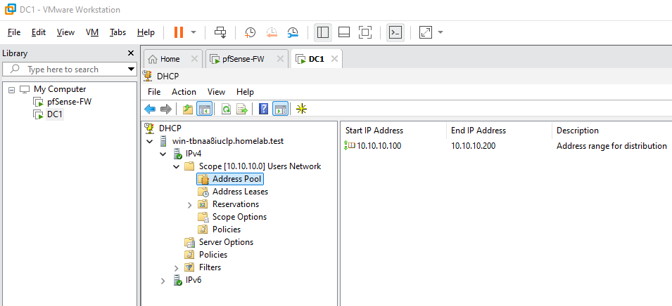

DHCP options provide the default gateway, DNS server, and domain name to clients.

  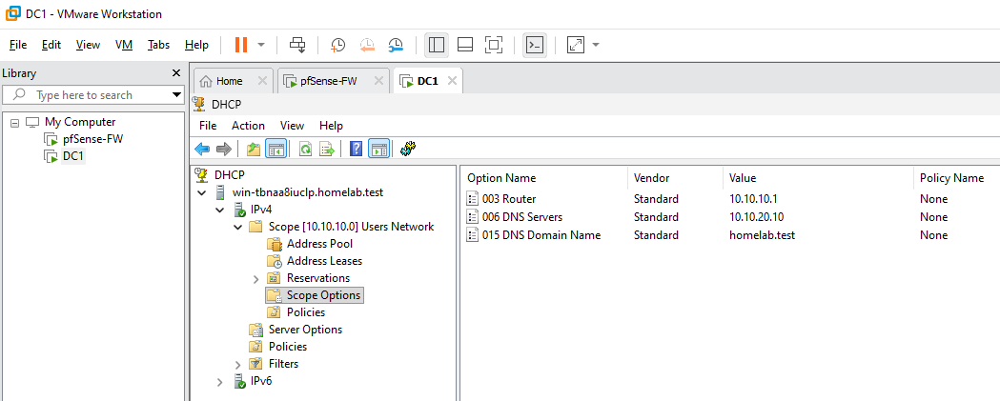

Because the DHCP server is on a different subnet from the Windows clients, pfSense was configured as a DHCP relay to forward requests between the Users and Servers networks.

## Group Policy and Department Resources

I created department-specific Group Policy Objects to apply different settings to HR and IT users.

HR users receive a mapped `H:` drive and a policy that restricts access to Control Panel.

  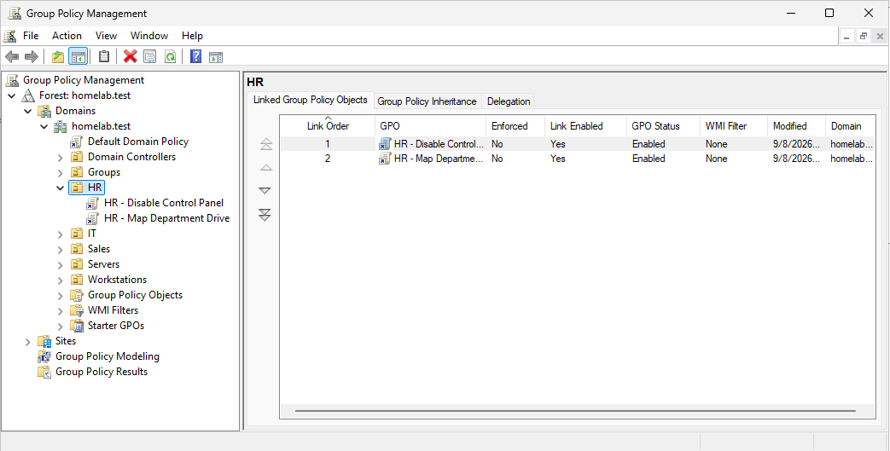

  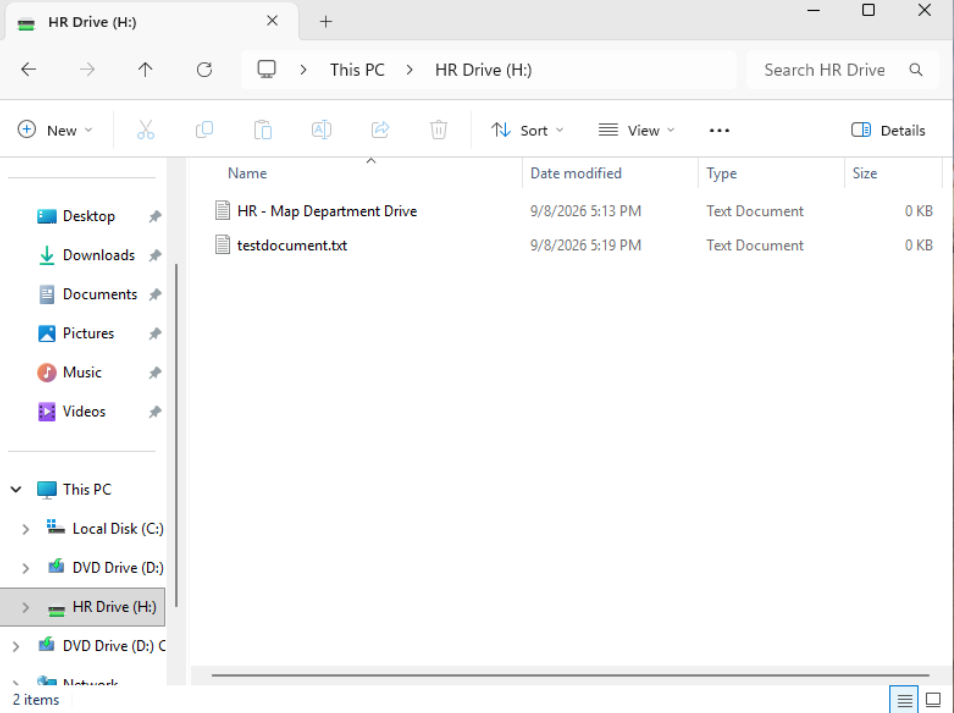

IT users receive their own mapped `I:` drive.

  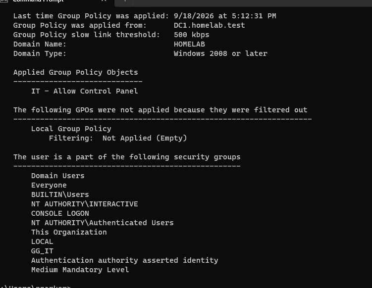

  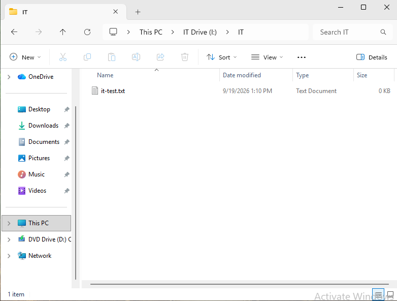

## PowerShell Automation

I created a PowerShell script that reads employee information from a CSV file and automates Active Directory user provisioning.

The script:
- Creates new domain users
- Places users into the correct Organizational Unit
- Adds users to the correct department security group
- Sets department attributes
- Assigns an initial password and requires a password change at first login

The results were verified using PowerShell.

  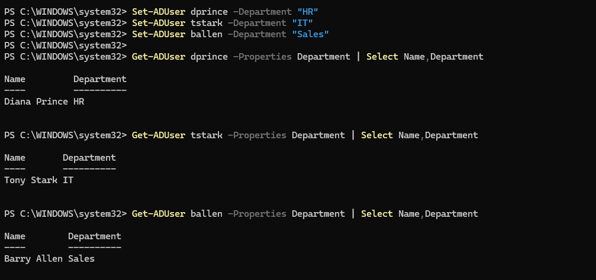

  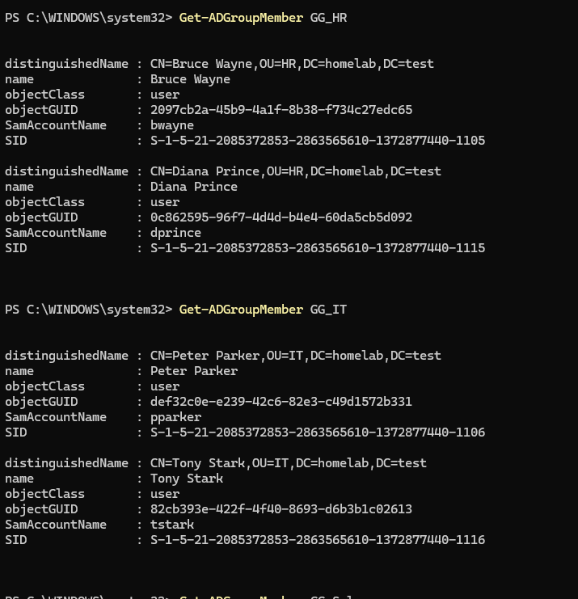

## Troubleshooting

### pfSense Connectivity
DC1 initially could not communicate with its pfSense gateway. I used `ping` and `arp -a` to confirm Layer 2 connectivity before correcting the firewall configuration.

  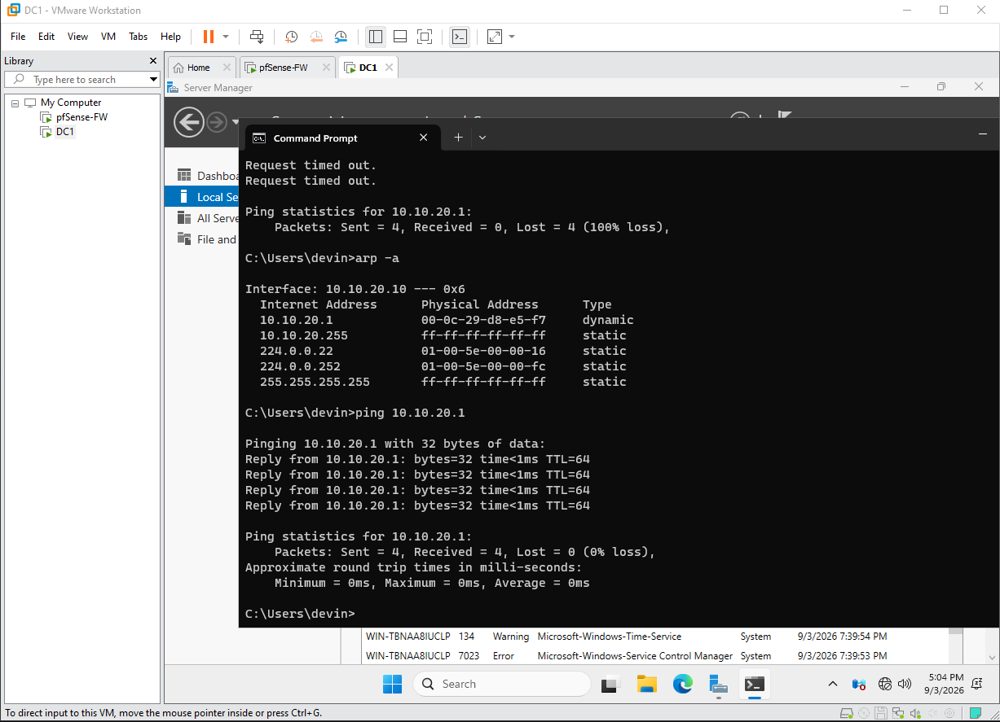

### Internet Routing
DC1 could reach pfSense but initially could not reach the internet. After correcting the pfSense firewall/routing configuration, connectivity to `8.8.8.8` succeeded.

  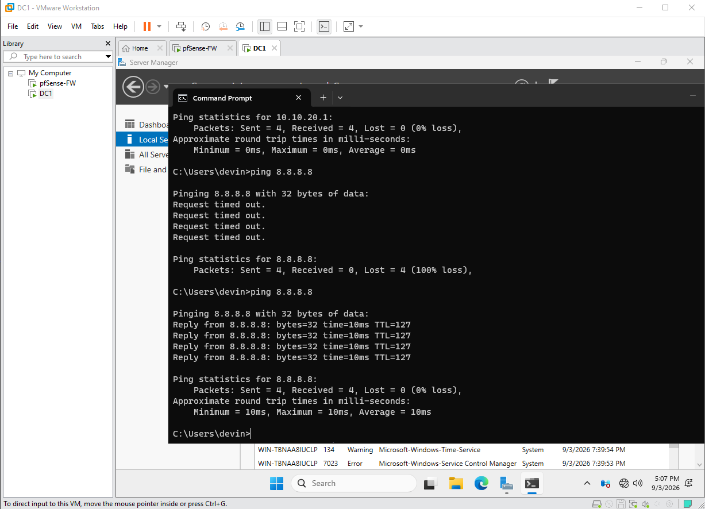

### DHCP Failure
WIN11-02 initially received an APIPA address (`169.254.x.x`), indicating that it could not contact the DHCP server. After correcting the DHCP relay/authorization path, the client successfully received `10.10.10.101`.

  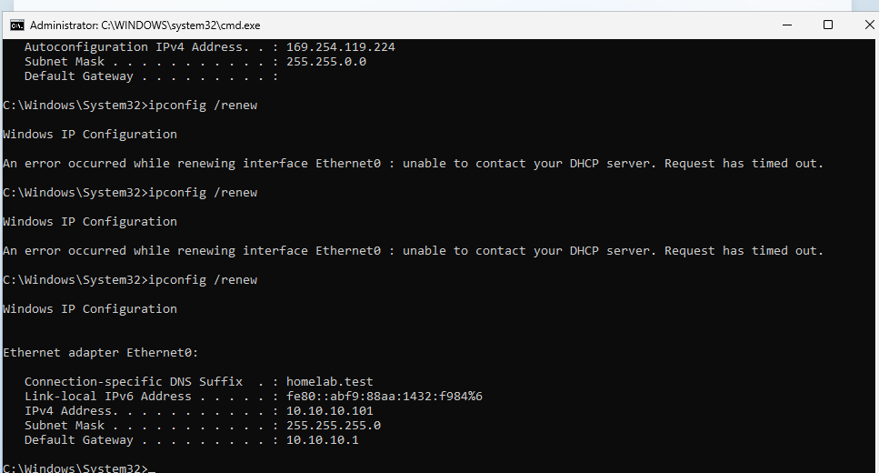

### Domain Controller Rename
After renaming the domain controller to `DC1`, the DHCP authorization entry still referenced the old hostname. I removed the stale authorization and re-authorized the DHCP server as `dc1.homelab.test`.

  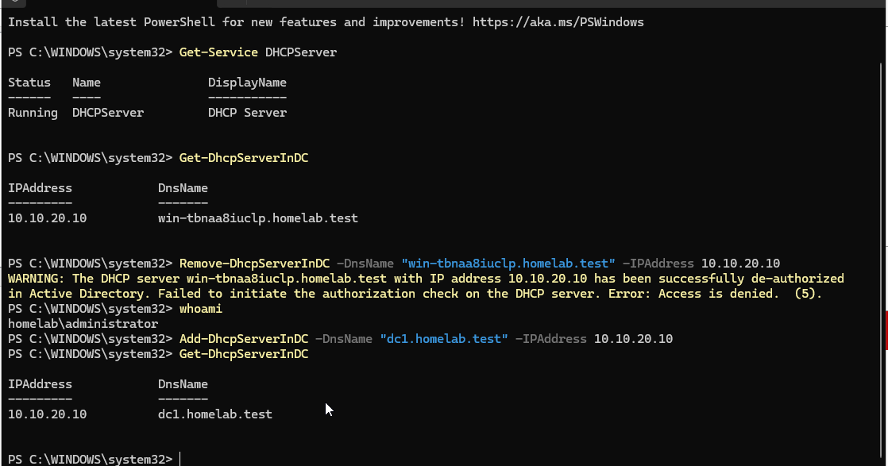

### Group Policy Time Synchronization
Group Policy initially failed because the Windows client was not properly synchronized with the domain time source. I reconfigured Windows Time to use the domain hierarchy, restarted the time service, resynchronized the clock, and confirmed successful Group Policy processing.

  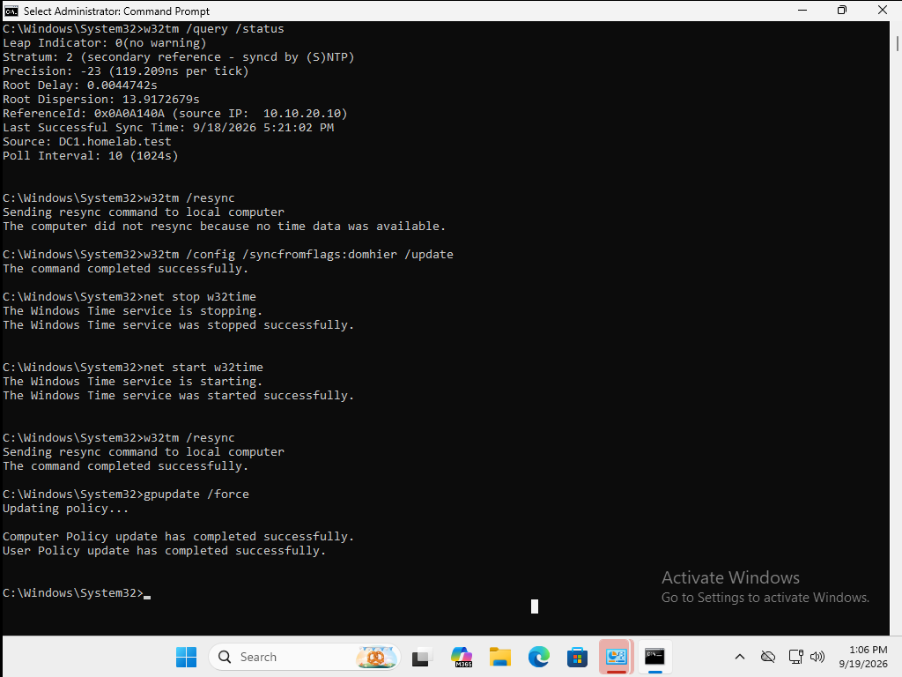

## What I Learned

This project helped me build a stronger understanding of how Active Directory, DNS, DHCP, Group Policy, routing, and permissions work together in a Windows domain environment.

It also gave me hands-on experience troubleshooting issues instead of only following a setup guide. I learned how to verify each layer of a problem using tools like `ping`, `arp`, `nslookup`, `gpresult`, and PowerShell before making changes.
